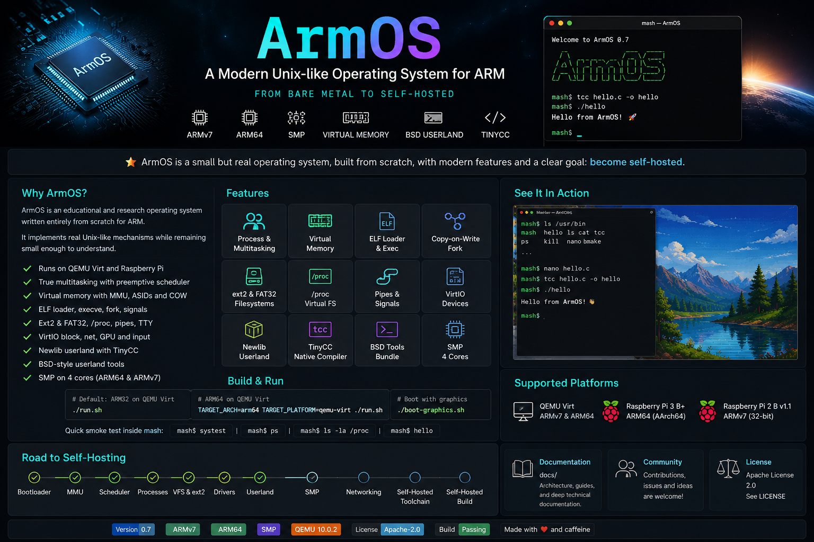
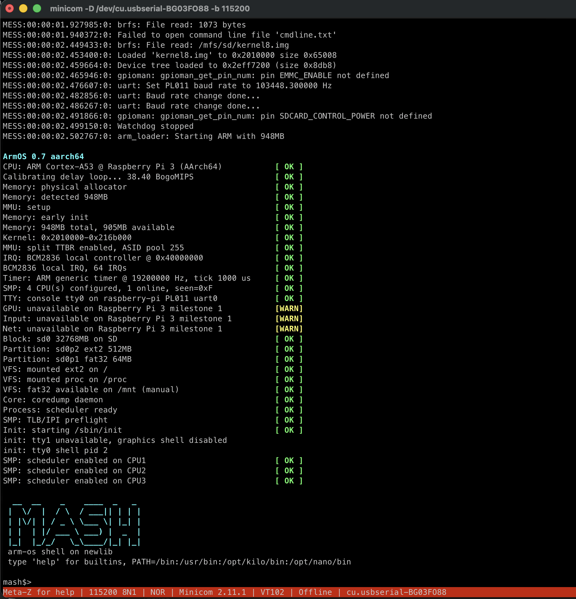
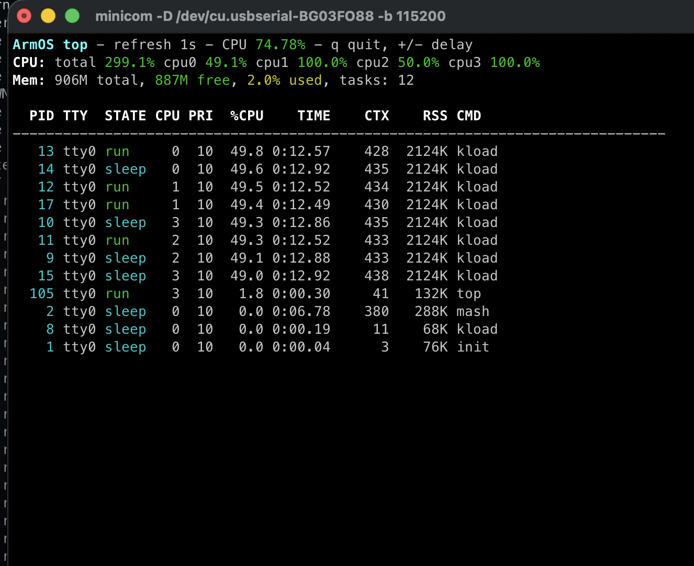
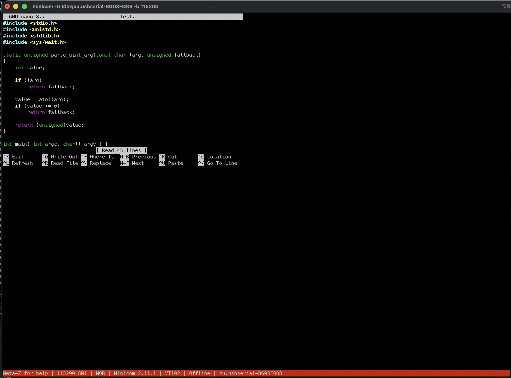
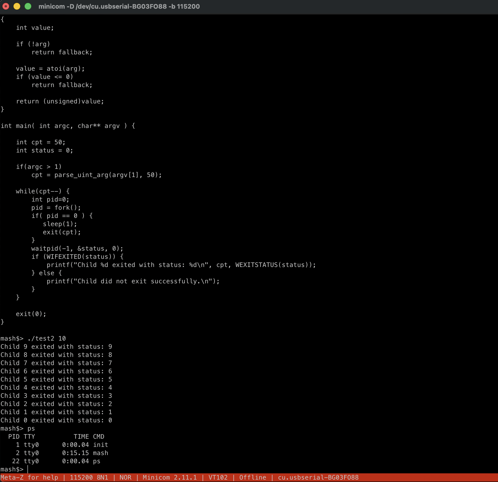
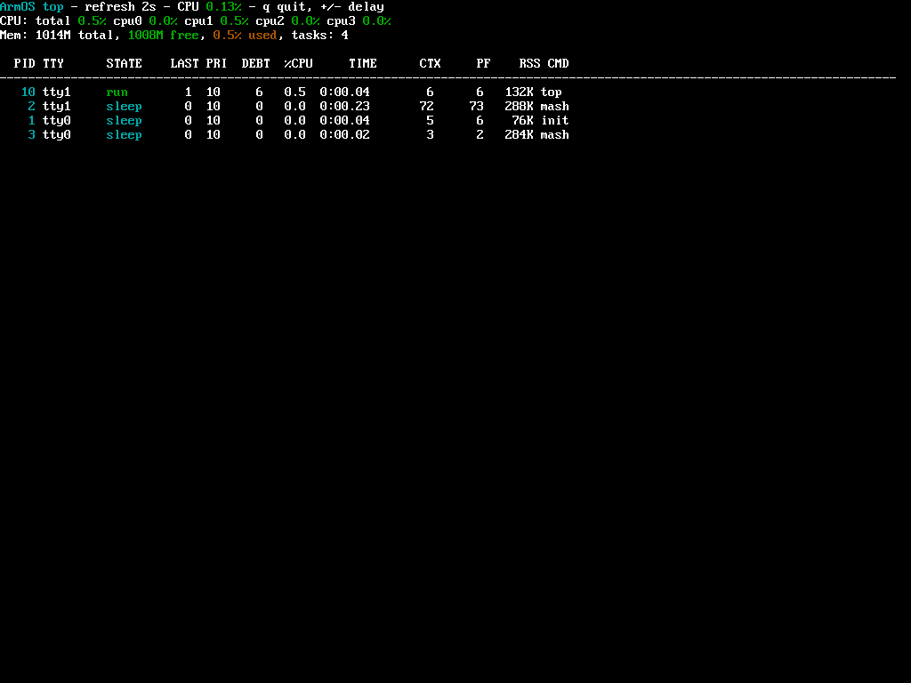

# ArmOS

<p align="center">
  
</p>

<p align="center">
  A compact Unix-like operating system written from scratch for ARM.<br>
  Small enough to study, complete enough to run real processes, filesystems,
  SMP workloads, and a native C toolchain.
</p>

<p align="center">
  <a href="https://github.com/dev-recon/ArmOS/releases/tag/v0.7"></a>
  
  
  
  <a href="LICENSE"></a>
</p>

ArmOS is an educational and research operating system, not a Linux
distribution. Version 0.7 brought ARM64 onto the same common kernel used by
ARM32: the architecture layer handles CPU and MMU details while processes,
syscalls, scheduling, VFS, filesystems, drivers, and userland contracts remain
shared.

## See It Run

### Raspberry Pi 3 B+

<table>
  <tr>
    <td width="50%"></td>
    <td width="50%"></td>
  </tr>
  <tr>
    <td align="center">AArch64 boot, MMU, SD/eMMC, ext2, FAT32 and SMP bring-up</td>
    <td align="center"><code>top</code> under <code>fork</code>, memory and CPU load on four cores</td>
  </tr>
</table>

These are direct UART captures from the current `arm64/raspi3` image running
on a Raspberry Pi 3 B+. They show the same common scheduler, VM, VFS and
userland used by the QEMU targets.

### Native development

<table>
  <tr>
    <td width="50%"></td>
    <td width="50%"></td>
  </tr>
  <tr>
    <td align="center">GNU nano 8.7 with syntax highlighting</td>
    <td align="center">TinyCC compiling and running a <code>fork</code>/<code>waitpid</code> program</td>
  </tr>
</table>

### Graphical console

<table>
  <tr>
    <td width="50%"></td>
    <td width="50%"></td>
  </tr>
  <tr>
    <td align="center"><code>top</code> on the VirtIO-GPU <code>tty1</code> console</td>
    <td align="center"><code>fbtest</code> writing directly to <code>/dev/fb0</code></td>
  </tr>
</table>

The graphical captures come from `arm64/qemu-virt`. The UART rescue console
remains available as `tty0` while the framebuffer console runs on `tty1`.

## Quick Start

Install the host dependencies for [macOS](INSTALLATION_macos.md) or
[Linux](INSTALLATION_linux.md), then:

```sh
git clone https://github.com/dev-recon/ArmOS.git
cd ArmOS
./run.sh
```

The default route builds and boots the conservative `arm32/qemu-virt` target.
Try the ARM64 reference kernel explicitly with:

```sh
TARGET_ARCH=arm64 TARGET_PLATFORM=qemu-virt ./run.sh
```

Open the graphical console with:

```sh
TARGET_ARCH=arm64 TARGET_PLATFORM=qemu-virt ./boot-graphics.sh
```

ArmOS also supports a local [`armos.conf`](docs/BUILD_CONFIGURATION.md) and
tracked configuration profiles, so architecture, platform, networking, GPU,
memory, and optional userland bundles do not have to be repeated on every
command line.

## What Is Inside

| Area | Current implementation |
| --- | --- |
| Processes | Preemptive scheduling, SMP, `fork`, ELF `execve`, `waitpid`, signals, job control |
| Virtual memory | Split user/kernel address spaces, MMU, ASIDs, copy-on-write, anonymous `mmap` |
| Files and IPC | VFS, descriptors, pipes, `dup`, ext2 root, FAT32, `/proc` |
| Devices | PL011 UART, TTYs, VirtIO block/net/GPU/input, Raspberry Pi SD/eMMC |
| Userland | newlib, `mash`, core Unix tools, editors, tests, optional BSD utilities |
| Native development | TinyCC can compile and run small C programs from inside ArmOS |

The normal contributor workflow still uses the host cross toolchain. Native
TinyCC is the next step toward self-hosting, not yet a replacement for the
release build system.

## Supported Targets

| Target | Role | CPU mode | Main devices |
| --- | --- | --- | --- |
| `arm32/qemu-virt` | Fresh-checkout default | ARMv7-A | GICv2, PL011, VirtIO |
| `arm64/qemu-virt` | Kernel feature reference | AArch64 | GICv2, PL011, VirtIO, 4-core SMP |
| `arm64/raspi3` | Hardware reference | AArch64 | Raspberry Pi 3 B+, PL011, SD/eMMC, 4-core SMP |
| `arm32/raspi2` | Supported hardware | ARMv7-A | Raspberry Pi 2 B v1.1, PL011, SD/eMMC |

QEMU 10.0.2 is the reference emulator for the v0.7 line. Hardware images use a
dedicated FAT32 firmware partition and an ext2 root filesystem.

## Try ArmOS

Once `mash` starts, a useful first tour is:

```sh
uname -a
ps
ls -la /
ls -la /proc
systest
```

A small native compilation looks like this:

```sh
printf '#include <stdio.h>\nint main(void){puts("hello from ArmOS");}\n' > hello.c
tcc hello.c -o hello
./hello
```

Optional packages include ncurses, GNU nano, BSD `bmake`, `sed`, `awk`,
`install`, `mtree`, `xargs`, `diff`, `patch`, `pax`, `tar`, `m4`, and ELF
inspection tools. They can be included through `armos.conf` or the existing
build flags.

## Documentation

- [Architecture](docs/ARCHITECTURE.md) - kernel structure, MMU, scheduler, VFS, TTYs, and drivers
- [Build configuration](docs/BUILD_CONFIGURATION.md) - targets, profiles, and `armos.conf`
- [Kernel development](docs/GET_STARTED_KERNEL_DEV.md) - source map and contributor workflow
- [Userland development](docs/GET_STARTED_USERLAND_DEV.md) - newlib programs and native experiments
- [ARM64 port](docs/ARM64_PORT.md) - AArch64 contracts and current implementation
- [POSIX compatibility](docs/POSIX_COMPATIBILITY.md) - implemented surface and priorities
- [Storage performance](docs/STORAGE_PERFORMANCE.md) - ext2, FAT32, and SD/eMMC measurements
- [Raspberry Pi 3](docs/RASPBERRY_PI3.md) and [Raspberry Pi 2](docs/RASPBERRY_PI2.md) - hardware guides
- [Roadmap](ROADMAP.md) and [stability notes](STABILITY.md)

## Project Status

ArmOS is experimental software. It is built to expose real operating-system
mechanisms clearly and to support serious testing, but it is not production
ready and does not promise a stable ABI yet. Current work focuses on POSIX
surface growth, storage performance, networking, graphical I/O, hardware
drivers, and the road to a self-hosted toolchain.

Contributions, experiments, bug reports, and documentation improvements are
welcome. Start with [CONTRIBUTING.md](CONTRIBUTING.md).

## License

ArmOS is licensed under the Apache License, Version 2.0. See
[LICENSE](LICENSE) and [NOTICE](NOTICE).
